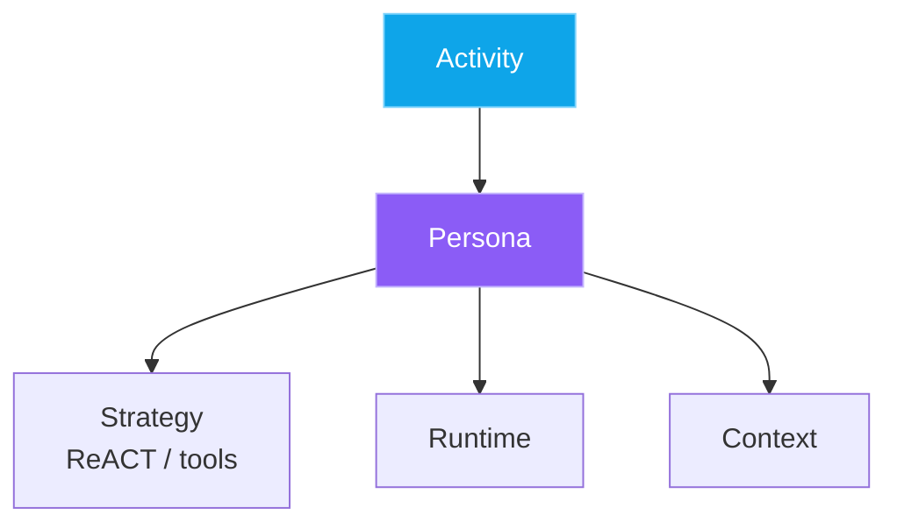

# Slide-document HTML guidance

Use `templates/slides-doc-template.html` as the implementation base. It already contains:

- full page shell
- typography and color system
- card/section layout
- light/dark mode styling
- Mermaid rendering
- zoom / pan / fit controls
- adaptive diagram sizing

Your job is to replace the placeholder content with real sections/cards while preserving the structural patterns below.

## Core idea

This format is a **scrolling document that feels like a slide deck**:

- each major section reads like a slide
- each section can contain one or more cards
- diagrams are embedded inline, not treated as separate apps
- the whole page should remain readable as a document first

## Authoring rules

### 1. Keep the page shell

Do not remove:

- `<main class="page">`
- `<header class="title-block">`
- section wrappers: `<section class="section">`
- divider lines: `<hr class="divider" />` where useful
- final `<script type="module">` Mermaid runtime

### 2. Use sections as slides

Each slide-like unit should usually be:

```html
<section class="section">
  <div class="section-head">
    <h2>Section title</h2>
    <p>Section framing.</p>
  </div>

  <!-- one or more cards here -->
</section>
```

### 3. Put content inside cards

Use cards for the actual payload.

Common patterns:

- `card pad decision`
- `card pad tradeoff`
- `card pad good`
- `card pad risk`
- plain `card pad`

Examples:

- thesis card
- comparison table card
- diagram card
- recommendation card
- mini-grid / stat summary card

## Supported content patterns

### Two-column synthesis card

```html
<article class="card pad decision">
  <h3><span class="badge">Thesis</span> Card title</h3>
  <div class="two-col">
    <div>
      <ul class="list">
        <li>Point</li>
      </ul>
    </div>
    <div>
      <div class="callout"><strong>Important:</strong> Main synthesis.</div>
    </div>
  </div>
</article>
```

### Stats row

```html
<div class="stat-row">
  <div class="stat">
    <div class="kicker">Label</div>
    <div class="value">Value</div>
    <div class="desc">Explanation.</div>
  </div>
</div>
```

### Mini-grid

```html
<div class="mini-grid">
  <div class="mini-card card good">
    <h4>Title</h4>
    <p>Description.</p>
  </div>
</div>
```

### Table card

```html
<article class="card pad good">
  <h3><span class="badge">Table</span> Comparison</h3>
  <div class="table-wrap">
    <table>
      <thead>
        ...
      </thead>
      <tbody>
        ...
      </tbody>
    </table>
  </div>
</article>
```

## Mermaid diagram rules

This is the most important part.

### Required structure

A Mermaid card must use this exact nesting shape:

```html
<article class="card pad diagram-shell">
  <h3><span class="badge">Visual</span> Diagram title</h3>
  <p style="margin:0;color:var(--text-dim);line-height:1.55;max-width:1120px;">
    Explain what the diagram clarifies.
  </p>
  <div class="mermaid-shell">
    <div class="mermaid-wrap">
      <div class="zoom-controls">
        <button type="button" data-action="zoom-in" title="Zoom in">+</button>
        <button type="button" data-action="zoom-out" title="Zoom out">&minus;</button>
        <button type="button" data-action="zoom-fit" title="Smart fit">&#8634;</button>
        <button type="button" data-action="zoom-one" title="1:1 zoom">1:1</button>
        <button type="button" data-action="zoom-expand" title="Open full size">&#x26F6;</button>
        <span class="zoom-label">Loading...</span>
      </div>
      <div class="mermaid-viewport">
        <div class="mermaid mermaid-canvas"></div>
      </div>
      <script type="text/plain" class="diagram-source">
        flowchart LR
          A[Start] --> B[End]
      </script>
    </div>
  </div>
</article>
```

### Critical constraint

`.diagram-shell` must be the outer container for the diagram card, and all required descendants must live inside it:

- `.mermaid-shell`
- `.mermaid-wrap`
- `.zoom-controls`
- `.mermaid-viewport`
- `.mermaid-canvas`
- `.diagram-source`

If this structure changes, the JS may not find the right nodes and the toolbar can get stuck on `Loading...`.

### Mermaid authoring tips

- Prefer `flowchart LR` or `flowchart TB` for synthesis diagrams.
- Use quoted HTML breaks instead of raw `\n` in labels:
  - good: `A["Strategy<br/>ReACT / RLM"]`
  - risky: `A[Strategy\nReACT / RLM]`
- Keep labels short.
- Style only a few important nodes.

Example:



## Writing guidance

### Title block

Use the page header for:

- source attribution
- one strong headline
- one lede paragraph

Good pattern:

- eyebrow = source or framing
- h1 = strongest synthesized claim
- lede = 2–3 sentence explanation

### Section style

Each section should answer one question, such as:

- what is the main thesis?
- what layers or components matter?
- what trade-offs shaped the conclusion?
- what is actionable now?
- what build path or recommendation follows?

### Card style

Each card should do one job:

- summarize
- compare
- visualize
- recommend
- warn

Avoid overloaded cards.

## Editing checklist

Before finishing, verify:

- page still scrolls vertically as a document
- cards remain readable in light and dark mode
- every Mermaid diagram renders on first load
- diagrams fit their containers initially
- zoom / pan still work after render
- no card has obvious dead whitespace below the diagram
- tables remain horizontally scrollable if wide

## When to duplicate a diagram card

If you need multiple diagrams, copy an entire `article.card.pad.diagram-shell` block and only change:

- title
- intro text
- Mermaid source

Do not rewrite the internal diagram wrapper structure.
